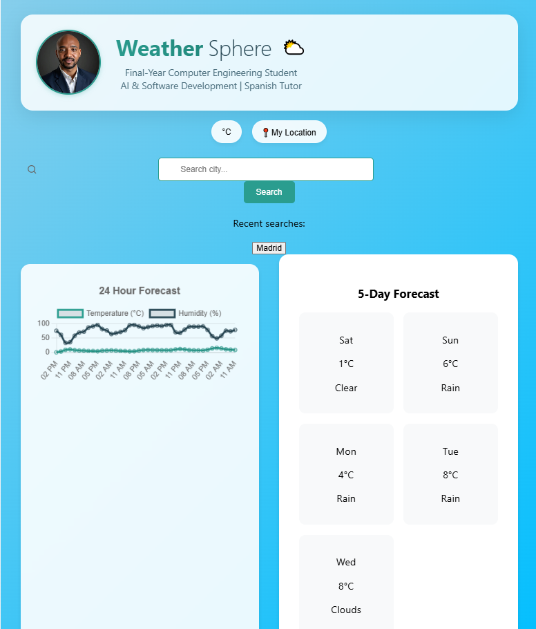

# WeatherSphere 🌤️

[](https://reactjs.org/)
[](LICENSE)

A modern weather application with stunning visuals and real-time data visualization.



## 🌟 Features
- Real-time weather updates
- 5-day interactive forecast
- Air quality monitoring
- Geolocation support
- Unit conversion (°C/°F)
- Search history
- Responsive design

## 🚀 Quick Start

### Prerequisites
- Node.js ≥16.13.0
- npm ≥8.1.0
- OpenWeather API key

### Installation
1. Clone repository:
```bash
git clone https://github.com/Owono2001/Weather_Sphere.git
cd Weather_Sphere


WeatherSphere 🌤️
Show Image
Show Image
A modern weather application with stunning visuals and real-time data visualization.
Show Image
🌟 Features

Real-time weather updates
5-day interactive forecast
Air quality monitoring
Geolocation support
Unit conversion (°C/°F)
Animated transitions
Search history
Responsive design

🚀 Quick Start
Prerequisites

Node.js ≥16.13.0
npm ≥8.1.0
OpenWeather API key

Installation

Clone repository:
bashCopygit clone https://github.com/Owono2001/Weather_Sphere.git
cd Weather_Sphere

Install dependencies:
bashCopynpm install

Create .env file:
envCopyREACT_APP_OPENWEATHER_API_KEY=your_api_key_here

Start development server:
bashCopynpm start


🛠️ Technologies

React 18
Framer Motion
Axios
React ChartJS 2
Weather Icons
CSS3 Animations


OpenWeatherMap API:

Current Weather: api.openweathermap.org/data/2.5/weather
5-day Forecast: api.openweathermap.org/data/2.5/forecast
Air Quality: api.openweathermap.org/data/2.5/air_pollution


💡 Usage Tips

Click 📍 to use your current location
Type city names with country codes (e.g., "London,GB")
Hover over charts for detailed info
Click recent searches to revisit

🐛 Troubleshooting
If you get API errors:

Verify your API key in .env
Check network connection
Ensure correct city spelling

📜 License
Distributed under MIT License. See LICENSE for details.